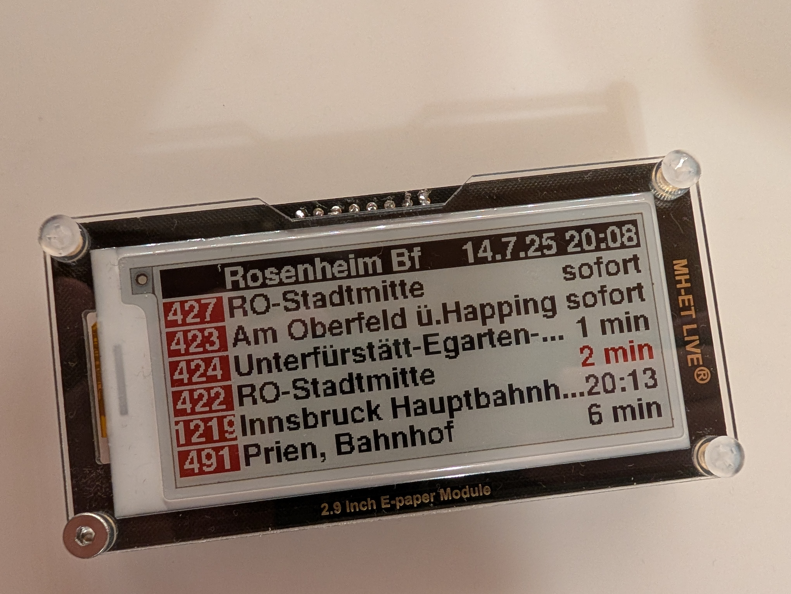
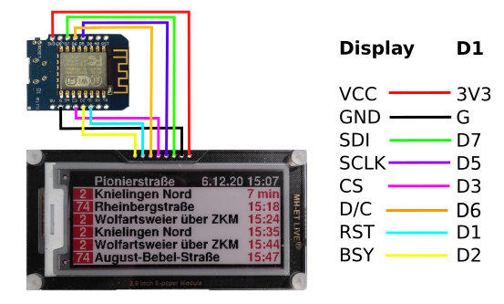
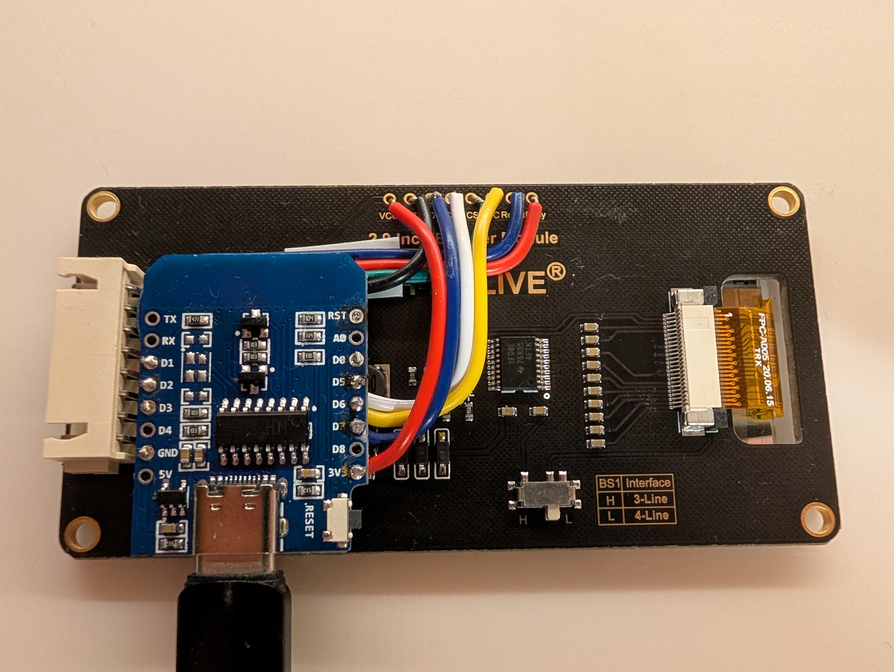
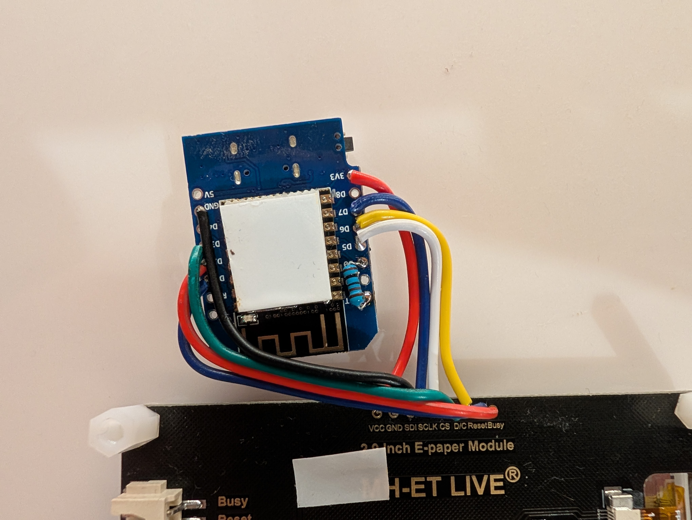

# MVG ePaper display

I learned at GPN23 in [Til Harbaum's talk](https://cfp.gulas.ch/gpn23/talk/CWFRB8/) from the project of building a virtual timetable for the KVV trams. 
But as I don't live in Karlsruhe, I had to adjust it for the MVG API, which includes all of the MVV area. 
Additionally, I adjusted it for the 4-color version of the ePaper display, so you have an additional yellow to choose from.

## differences to Til Harbaum's KVV

* Use GxEPD2 instead of Adafruit EPD to use the 4-color version of the display instead of the 3-color one
* Implement the MVG API instead of the KVV API
* Use pin D0 to wake up the ESP from deepSleep; use another Pin for the display
* There is a timer instead of the scheduled time, if there is real-time data for a connection; instead of showing the timer departure is in less than 10 minutes
* time/timer on the right is black by default, but red if connection has a delay
* The station name won't set automatically, as you'd need a second HTTP request to get the name based on the ID. We enter it ourself.

## Hardware setup

The whole setup is pretty simple and can be wired on a breadboard as depicted.

IMPORTANT NOTE: This picture shows the wiring made by the original repository. Connect the Display's D/C with any other pin than D0, for example D6. Then connect a wire (or better, a resistor somewhere in the kΩ range) to D0 and RST of the ESP. D0 is used to wake up the ESP after a set amount of time. This way, it will refresh automatically. If you choose not to connect D0 with RST, you'll need to push the Reset Button to update the display manually. Tip: Bridge those pins only when you're done flashing the ESP8266. Bridging them will make the repeated flashing process more complex, as you will need to press the Reset Button before uploading the file or even unplug and replug the ESP each time you want to flash it.

> Since the epaper display keeps the data even if not powered at all the ESP8266 simply boots up, connects to the (hardcoded) WiFi network, downloads the live data, updates the display and then powers down/goes into deep sleep. The whole setup can thus be run from a battery with the reset button exposed so it can be pushed to boot the ESP8266 and to update the display.

## Software setup

* [Download and install Arduino IDE](https://www.arduino.cc/en/software/)
* Use the Arduino IDE and open the folder with the .ino file as well as the wifi.h and font.
* enter `https://arduino.esp8266.com/stable/package_esp8266com_index.json` into the File>Preferences>Additional Boards Manager URLs field of the Arduino IDE. You can add multiple URLs, separating them with commas.
* Open Boards Manager from Tools > Board menu and install esp8266 platform (and don't forget to select your ESP8266 board from Tools > Board menu after installation).
* Add the needed libraries. The compiler will tell you if there are missing some
* Copy `GxEPD2_290c_GDEY029F51` and `GxEPD2_290c_GDEY029F51` into the folder `Arduino/libraries/GxEPD2/src/epd4c/` GxEPD2 doesn't currently support this 4-color version of the display, which's why we have to use these edited filed, as described in [this blogpost](https://kravemir.org/how-to/control-4-color-mh-et-live-epaper-using-arduino/).
* Edit your Wi-Fi credentials in the wifi.h file
* Now edit the values inside the mvg.ino file to your desire(`STOP_ID`, `stopName`, `TRANSPORT_TYPES`, `OFFSET`, eInk pins, Colors)
Warning: If you bridged D0 and RST, you'll probably need to unplug and replug the ESP each time before you can flash it
Another Warning: Don't refresh too often (`ESP.deepSleep(120e6);`), or else you will run into a rate limit (HTTP Code 509)

## Final setup

> For the final setup depicted above I used double sided tape to stick the Wemos D1 to the display. A total of eight short wires are needed to connect both PCBs. The resulting setup is sufficiently small and robust.
You may even add a battery, a charging board and put it in a 3D-printed case to make it both portable and beautiful.

## Where does the data come from?

This sketch uses the new, unofficial MVG API at https://www.mvg.de/api/bgw-pt/v3/, to be precise we use https://www.mvg.de/api/bgw-pt/v3/departures?, which uses JSON (yay). The previous API from 2020 at www.mvg.de/api/fahrinfo went offline in 2024.

The station ID of the station to be displayed is hardcoded into the sketch. By default this is set to "de:09163:9" which is the ID of the station of Rosenheim. The API allows to search for IDs by station names and even parts of it. E.g. to search for any station including "Rosenheim" in its name use the following search: [https://www.mvg.de/api/bgw-pt/v3/locations?query=Rosenheim](https://www.mvg.de/api/bgw-pt/v3/locations?query=Rosenheim). For other stations replace "Rosenheim" with the phrase you are searching for. The station IDs can then be read from the `name` field in the JSON reply.

## The sketch

First and foremost, most of this program is based on [Til Harbaums Repository "KVV"](https://github.com/harbaum/kvv).
The sketch is based on the [BasicHttpsClient.ino](https://github.com/esp8266/Arduino/blob/master/libraries/ESP8266HTTPClient/examples/BasicHttpsClient/BasicHttpsClient.ino) for the ESP8266. The display is driven using the [GxEPD2 library](https://github.com/ZinggJM/GxEPD2). And finally the JSON parsing is done using the [ArduinoJson library](https://github.com/bblanchon/ArduinoJson). All these dependencies can be installed from the library manager within the Arduino IDE.

A custom generated font is being used since the fonts distributed by Adafruit with the Adafruit GFX library only include 7 bit fonts and we need an 8 bit font for the german umlauts used by the MVG.